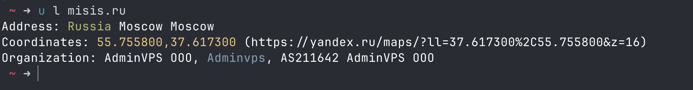

## Урок 3 - WEB 1 — HTTP, REST API и FastAPI
HTTP, JSON и REST (Representational State Transfer) API, валидатор Pydantic и веб-фреймворк FastAPI.

## ДЗ 3 — Локация адресса
Начиная с этого ДЗ и далее, если вы используете сторонние библиотеки `requests`, `fastapi` и тд), вначале ДЗ их, чтобы проверяющий мог их установить, например:
```shell
pip install requests==2.32.5 
```
Быстро получить список зависимостей можно так: `pip freeze | grep -e requests -e fastapi`

Есть множество сервисов, позволяющих получить местоположение IP-адреса, например ip-api.com. В этот сервис можно обращаться по API, например:
```shell
  ~ ➜ curlie http://ip-api.com/json/misis.ru # вместо misis.ru можно указать IP-адрес или домен
HTTP/1.1 200 OK
Date: Sun, 12 Oct 2025 11:34:44 GMT
Content-Type: application/json; charset=utf-8
Content-Length: 270
Access-Control-Allow-Origin: *
X-Ttl: 38
X-Rl: 43

{
    "status": "success",
    "country": "Russia",
    "countryCode": "RU",
    "region": "MOW",
    "regionName": "Moscow",
    "city": "Moscow",
    "zip": "144700",
    "lat": 55.7558,
    "lon": 37.6173,
    "timezone": "Europe/Moscow",
    "isp": "AdminVPS OOO",
    "org": "Adminvps",
    "as": "AS211642 AdminVPS OOO",
    "query": "5.253.61.53"
}
```
Ваша задача написать скрипт, который принимает на вход IP-адрес или домен, ищет его местоположение через ip-api и выводит его местоположение в цветах, например:
```shell
> python3 main.py misis.ru
Address: <green>Russia</> Moscow Moscow
Coordinates: <yellow>55.755800,37.617300</> (https://yandex.ru/maps/?ll=37.617300%2C55.755800&z=16)
Organization: AdminVPS OOO, <cyan>Adminvps</>, AS211642 AdminVPS OOO
```


> Чтобы считать аргумент из консоли (misis.ru) используйте, например, `import sys; sys.argv[1] # "misis.ru"`

> Чтобы отправить запрос используйте библиотеку `requests`, чтобы распарсить ответ - `json` 

> Чтобы покрасить текст вывода используйте ANSI [цвета](https://gist.github.com/rene-d/9e584a7dd2935d0f461904b9f2950007), либо готовую библотеку, [например](https://pypi.org/project/ansi/).

