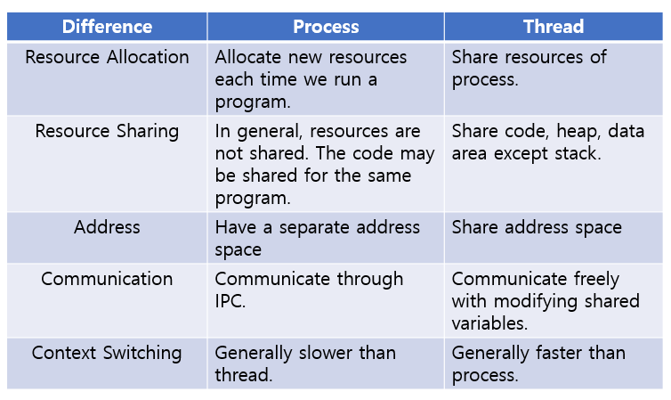
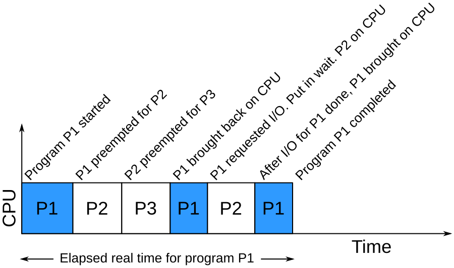
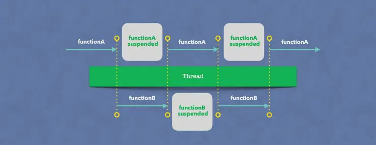
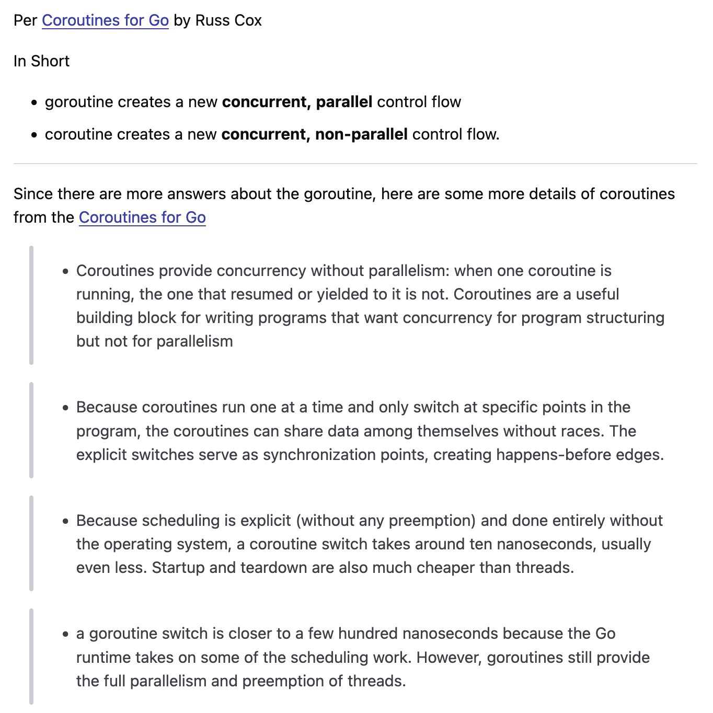

## Процесс
Процесс - последовательный набор выполняемых команд и обусобленной памятью. 2 процесса не могут делить один участок памяти. В линуксе у каждого процесса есть свой идентификатор (PID).
```shell
# Посмотреть все запущенные _питоны_
ps aux | grep "python"
```

## Тред (поток)
Грубо говоря - тоже последовательность команд, но тред запускается в процессе и *может* делить память с другими тредами



## IO vs CPU - bound
CPU-bound операции, это такие операции, которые требуют только процессорного времени. <br>
Например:
- Сложить 2 числа
- Поменять значения двух переменных
- Вычислить степень числа

```python
# cpu bound
2 + 3
```

IO-Bound операции, это такие операции, которые НЕ требуют процессорного времени. <br>
Например:
- Отправить HTTP запрос
- Считать звук с микрофона
- Записать файл

```python
import requests

# io-bound
requests.get("https://google.com")
```

## Параллелизм

В древности (20 лет назад), у многих ПК было только 1 ядро. Как тогда могли работать 10-20-100 программ (процессов) одновременно? <br>
Ответ: никак, они просто переключались



### Переключение контекста
Процесс прекращения выполнения процессором одной задачи (процесса, потока, нити) с сохранением всей необходимой информации и состояния, необходимых для последующего продолжения с прерванного места, и восстановления и загрузки состояния задачи, к выполнению которой переходит процессор.

> Иными словами - это ДОРОГО

Например, если вам нужно 10 раз сходить в удаленную базу данных, то выполняя 10 запросов в 10 тредах, время выполнения всего кода будет ниже, чем выполняя код последовательно, но процессорного времени (CPU Time) будет потраченно суммарно больше.

## Корутины

Это компоненты программы, которые позволяют выполнить прерываемые вычисления


## Гринтреды, виртуальные треды или горутины

Почти как корутины, грубо говоря, это те же самые треды, но быстрее за счет того, что ими управляет язык программирования или виртуальная машина (Go, JVM), а не ОСь (Linux, Unix)


## GIL

В питоне все ещё веселее! <br>
GIL - это особенность интерпретатора Python, которая ограничивает одновременное выполнение нескольких потоков Python-кода в одном процессе <br>
Иными словами 2 треда не могут выполняться одновременно!

> Кроме как на io-bound операциях!
