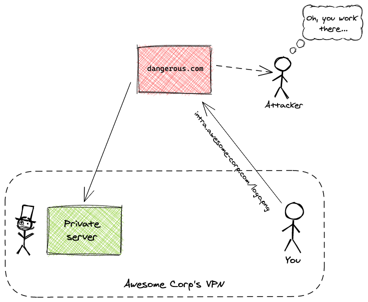
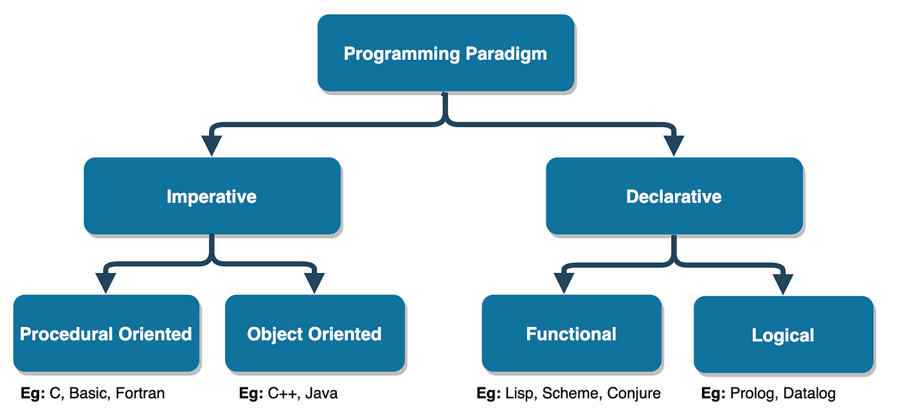

## Глава 11 - Backend: NGINX, CORS и какой язык все-таки лучше?

### NGINX
(Читается либо нжинкс, либо энджайн-икс)  

Это сишный веб сервер, который умеет:
- Раздавать статику, то есть статический фронтенд
- Проксировать запросы
- SSL
- Кешировать ответы
- И много чего ещё

### СORS (Cross-Origin Resource Sharing)
Это система, которая на уровне браузера запрещает с одного сайта (домена) отправлять запросы на другой домен. Нужно для безопасности 

 
Чтобы браузер разрешил нам отправлять запросы на другой ресурс - надо возвращать `cors` заголовки.

## _Языки программирования_

## Классификации

### Специализация
- GPL: общего назначения, можно использовать для всего подряд
> i.e: Python, Go, Rust, C, Java
- DPL: языки под конкретную область, только в ней они используются
> i.e: SQL, MatLab, HCL

### Управление памятью
- Полная свобода: разработчик сам должен очищать память
> i.e: C, C++, Zig
- Borrow-checker: разработчик сам должен очищать память, но компилятор не скомпилирует код, если память не очиститься
> i.e: Rust
- Сборка муссора: память автоматически очищается
> i.e: Python, Go, Java, C#

### Компилируемость
- Компилируемые: те, которые надо сначала перевести на машинный код перед запуском
> i.e: Go, Java, C, C++
- Интерпретируемые: те, которые во время работы сами переводят код на машшиный код
> i.e: Python, JS

### Типизируемость
- Строгая: нужно указывать типы данных в функциях
> i.e: Go, Java, C, C++
- Динамическая: типы указывать не нужно / не обязательно
> i.e: Python, JS

### Парадигмы

- Императивные: мы описываем порядок действий
> i.e: Go, Python, JS, Rust, Java
- Декларативные: мы описываем конечный результат
> i.e: SQL, HCL

### Абстрагируемость
- Высоко-уровневые: язык абстрагирует реальное поведение битов-байтов от разработчика
> i.e: Java, Python, Go, Rust, C++
- Низко-уровневые: язык не абстрагируется и старается быть ближе к реальному положению дел
> i.e: C, C++, Go, Rust
