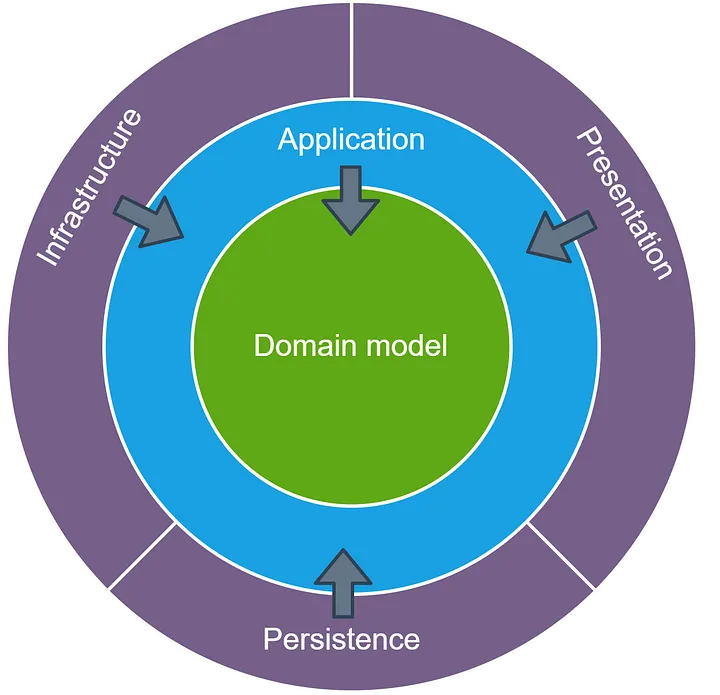

## Глава 11 - Backend: Стили, линтеры, расширяемость и паттерны

Что самое сложное в программрование?
- Высоконагруженные системы?
- Машинное обучение?
- Низкоуровневая разработка?
- Критические системы?

> There are only two hard things in Computer Science: cache invalidation and naming things.
>    -- Phil Karlton

Самая сложная задача - написать такой код, в котором:
- Легко найти баг, если они есть
- Легко исправить баг, если они есть
- Легко дополнить новыми фичами
- Легко убрать фичи, которые больше не нужны
- Легко читать
И все это может сделать не только автор кода, но и другие разработчики

## Как этого добится?
- Стиль: как переменные именуются, сколько отступов, какие кавычки использовать и тд
- Архитектура кода: где что лежит, какие папки, какие модули?
- Архитектура проекта: какая таблица в БД за что отвечает, какие есть эндпоинты и тд?
- Размер команды: чем меньше команда, тем проще
- Паттерны, стандарты, соглашения, правила: SOLID, CQSR, DDD, TDD, Onion, KYSS, DRY
- Тесты: если код протестирован, то меньше страха его менять

## Стили
В python существует стандарт форматирования кода: [pep8](https://peps.python.org/pep-0008/)

## Линтеры
- [Pre-commit hooks](https://github.com/pre-commit/pre-commit) - утилита, для автоматической проверки кода и файлов на "качество" перед коммитами в репозиторий.
- [Ruff](https://github.com/astral-sh/ruff) - утилита, для проверки питоновского кода на _качество_

## Тесты
- [PyTest](https://docs.pytest.org/en/stable/)

## Луковичная архитектура

## Монолит vs Микросервисы

### Монолит
- Одна команда
- Один репозиторий
- Одна база данных
- Одно приложение
- Один сервер

Плюсы:
- Первое время намного проще
Минусы:
- Если что-то где-то сломается, может сломаться весь проект
- Сложно расширять

### Микросерисы
- Отдельная команда
- Отдельный репозиторий
- Отдельные базы данных
- Отдельные приложения
- Отдельные сервера

Плюсы:
- Если что-то где-то сломается, то пострадает не все
- Проще расширять
Минусы:
- Намного сложнее первое время, особенно из-за синхронизации транзакций.

### Распределенный монолит
- Один репозиторий
- Одна команда
- Базы данных могут быть отдельными, если нужно
- Отдельные приложения, под каждый API
- Запускаем код на разных сервера

Плюсы:
- Простота монолита
- Расширяемость и стабильность микросервисов
Минусы:
- Если проект станет очень большим, то все равно придется пилить на микросервисы
